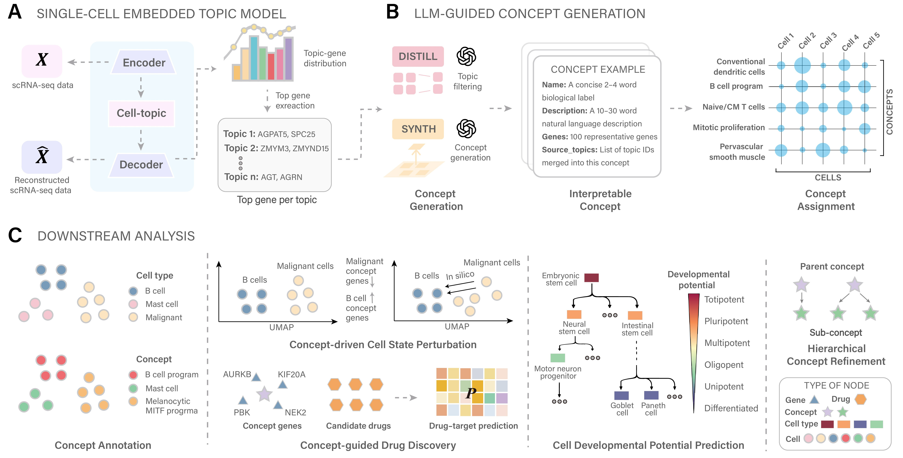

# scConcept: Concept-level exploration of single-cell transcriptomic data

[](LICENSE.txt)

scConcept is a unified framework for discovering biologically interpretable gene programs (“concepts”) from single-cell RNA-seq data by integrating neural topic models with large language models (LLMs).

---

## 📖 Overview

scConcept enables **concept-level interpretation of single-cell transcriptomic data**, bridging gene-level signals and cell-level states through LLM-guided abstraction.

### Schematic overview of scConcept



**(A) Topic extraction from single-cell data.**  
A neural topic model is applied to scRNA-seq data to learn topic–gene distributions. For each topic, the top 100 genes with the highest weights are selected to characterize its underlying biological signal.

**(B) LLM-based concept generation.**  
Topic gene sets are distilled using a large language model to filter incoherent topics and merge related ones into coherent biological concepts. Each concept is defined by a concise name, a natural language description, and a representative gene set. These concepts are mapped back to individual cells based on gene expression.

**(C) Concept-driven downstream analysis.**  
Concept-level representations enable:
- cell annotation
- cell state perturbation
- concept-guided drug discovery
- developmental potential prediction
- hierarchical concept refinement

---

## 🚀 Run scConcept in Google Colab

We provide a ready-to-use Google Colab notebook that allows you to run scConcept
without any local installation.

- Includes a **preprocessed demo dataset (`pollen.mat`)**
- Supports **custom data upload**
- Covers the **full pipeline**: topic → concept → annotation

You can run the full pipeline in minutes using the default dataset,
or switch to your own data by setting `USE_DEMO_DATA = False`.

[](
https://colab.research.google.com/github/li-lab-mcgill/scConcept/blob/main/Tutorial/tutorial_0_colab_quickstart.ipynb
)

---

## 🔧 Installation

> **Note**: The full installation process, including environment setup and dependency installation, typically takes **1–1.5 hours**.

```bash
# 1. Create environment
conda create -n scConcept python=3.11.14 -y
conda activate scConcept

# 2. Install PyTorch (CUDA 12.8)
pip install torch==2.9.0 torchvision==0.24.0 torchaudio==2.9.0 \
--index-url https://download.pytorch.org/whl/cu128

# 3. Install scConcept
git clone https://github.com/li-lab-mcgill/scConcept.git
cd scConcept
pip install -r requirements.txt
```

---

## 🚀 Quick Start

```python
from scConcept import ScConcept

# Initialize the main API
scconcept = ScConcept()
```

---

## 🧬 1. Data Processing

scConcept supports **raw / count single-cell data** and automatically:

- selects top 10,000 highly variable genes (HVGs)
- applies log transformation
- converts the processed matrix into `.mat` format for topic modeling

### Supported input formats

- `.csv` count matrix + label file
- `.h5ad` (AnnData)

### Example 1: CSV input

```python
from scConcept import ScConcept

scconcept = ScConcept()

# input_name: raw/count matrix stored in scConcept/Datasets/
# label_name: corresponding label file stored in scConcept/Datasets/
# output_name: name of the processed dataset for downstream use
mat_file = scconcept.dataprocess(
    input_name="your_count_matrix.csv",
    label_name="your_cell_label.csv",
    output_name="your_dataset"
)

print("processed mat file:", mat_file)
```

### Example 2: AnnData input

```python
from scConcept import ScConcept

scconcept = ScConcept()

# input_name: .h5ad file stored in scConcept/Datasets/
# label_key: column name in adata.obs used as labels
mat_file = scconcept.dataprocess(
    input_name="your_dataset.h5ad",
    output_name="your_dataset",
    label_key="cell_type"
)

print("processed mat file:", mat_file)
```

### Output path

Processed datasets are saved to:

```text
scConcept/Datasets/<output_name>.mat
```

---

## 🧠 2. Topic Extraction

scConcept uses ECRTM to extract latent gene programs from processed single-cell datasets.

```python
from scConcept import ScConcept

scconcept = ScConcept()

topic_file = scconcept.topic(
    dataset="your_dataset",  # processed dataset name, without .mat suffix
    n_topic=50,              # number of latent topics
    epochs=500,              # training epochs
    batch_size=2048,         # batch size for training
    device="cuda:0"          # choose GPU, e.g. "cuda:0", "cuda:1", or "cpu"
)

print("topic_file:", topic_file)
```

### Output paths

Topic gene files are saved under:

```text
scConcept/ECRTM/output/topics/<dataset>/
```

Model checkpoints are saved under:

```text
scConcept/ECRTM/output/models/<dataset>/
```

---

## 🧩 3. Concept Generation

The extracted topic gene lists are distilled into coherent biological concepts using an LLM.

```python
from scConcept import ScConcept

scconcept = ScConcept()

concepts = scconcept.concept(
    topic_file=topic_file,   # topic gene file returned by scconcept.topic(...)
    api_key="YOUR_API_KEY",  # OpenAI API key
    model="gpt-5"            # LLM model used for concept generation
)

print("num concepts:", len(concepts))
print("first concept:", concepts[0])
```

### Output path

Generated concept files are saved to:

```text
scConcept/Results/<dataset>/<dataset>_concepts.json
```

---

## 🔬 4. Cell Annotation

Cells are annotated by mapping concept gene sets back to single-cell expression profiles.

```python
from scConcept import ScConcept

scconcept = ScConcept()

scores, concept_names, pred_labels = scconcept.annotation(
    concepts=concepts,       # concept list returned by scconcept.concept(...)
    dataset="your_dataset",  # processed dataset name
    topk=100                 # number of genes retained for each concept
)

print("scores shape:", scores.shape)
print("first 10 predicted labels:", pred_labels[:10])
```

### Output paths

Predicted concept labels are saved to:

```text
scConcept/Results/<dataset>/<dataset>_pred_concepts.json
```

Concept score matrices are saved to:

```text
scConcept/Results/<dataset>/<dataset>_concept_scores.npy
```

---

## 📊 5. Evaluation and Visualization

### Evaluation

```python
from scConcept import ScConcept

scconcept = ScConcept()

metrics = scconcept.evaluation(
    concepts=concepts,
    dataset="your_dataset",
    species="human"  # choose "human" or "mouse"
)

print("metrics:", metrics)
```

### Visualization

```python
from scConcept import ScConcept

scconcept = ScConcept()

# Performs PCA + UMAP visualization using the processed dataset
adata_vis = scconcept.visualization(
    dataset="your_dataset"
)

print("UMAP done.")
```

### Output paths

Evaluation results are saved to:

```text
scConcept/Results/<dataset>/<dataset>_evaluation.json
```

Visualization-related files are typically stored in memory through `adata_vis` and can be used for further plotting or downstream analysis.

---

## 🌱 6. Developmental Potential Analysis

scConcept can also infer **developmental potency programs** from topic gene lists.

### Step 1: Extract developmental potency concepts

```python
from scConcept import ScConcept

scconcept = ScConcept()

dconcepts = scconcept.dconcept(
    topic_file=topic_file,
    api_key="YOUR_API_KEY",
    model="gpt-5"
)

print("num dconcepts:", len(dconcepts))
print("first dconcept:", dconcepts[0])
```

### Step 2: Developmental annotation

```python
from scConcept import ScConcept

scconcept = ScConcept()

scores, concept_names, pred_labels = scconcept.dannotation(
    concepts=dconcepts,         # developmental concepts returned by scconcept.dconcept(...)
    dataset="your_dataset",     # processed dataset name
    topk=100                    # number of genes retained for each developmental concept
)

print("scores shape:", scores.shape)
print("first 10 predicted developmental labels:", pred_labels[:10])
```

### Developmental potency categories

scConcept uses the following potency categories:

- Toti.  (totipotent)
- Pluri. (pluripotent)
- Multi. (multipotent)
- Oligo. (oligopotent)
- Uni.   (unipotent)
- Diff.  (differentiated)

### Output paths

Developmental potency concept files are saved to:

```text
scConcept/Results/<dataset>/<dataset>_potency_concepts.json
```

Predicted developmental labels are saved to:

```text
scConcept/Results/<dataset>/<dataset>_pred_dconcepts.json
```

Developmental concept score matrices are saved to:

```text
scConcept/Results/<dataset>/<dataset>_dconcept_scores.npy
scConcept/Results/<dataset>/<dataset>_dconcept_scores_for_pred.npy
```

---

## 🌳 7. Hierarchical Concept Refinement

scConcept supports hierarchical concept refinement to split heterogeneous first-layer concepts into more specific second-layer sub-concepts.

### Step 1: First-layer concept annotation

```python
from scConcept import ScConcept

scconcept = ScConcept()

scores, concept_names, pred_labels = scconcept.annotation(
    concepts=concepts,
    dataset="your_dataset",
    topk=100
)

print("scores shape:", scores.shape)
print("first 10 first-layer labels:", pred_labels[:10])
```

### Step 2: Hierarchical concept generation

```python
from scConcept import ScConcept

scconcept = ScConcept()

refined_results, flat_concepts = scconcept.hconcept(
    concepts=concepts,                 # first-layer concepts
    scores=scores,                     # first-layer cell-by-concept score matrix
    dataset="your_dataset",
    api_key="YOUR_API_KEY",
    tau_frac=0.5,                      # threshold for selecting high-confidence cells
    min_cells=30,                      # minimum number of cells required to test splitting
    min_leaf=20,                       # minimum child cluster size
    min_impurity_reduction=0.1         # minimum impurity reduction for accepting split
)

print("num refined parent concepts:", len(refined_results))
print("num flattened second-layer concepts:", len(flat_concepts))
print("first second-layer concept:", flat_concepts[0])
```

### Step 3: Hierarchical annotation

```python
from scConcept import ScConcept

scconcept = ScConcept()

scores_level, subconcept_names, pred_subconcepts = scconcept.hannotation(
    dataset="your_dataset",  # processed dataset name
    topk=100                 # number of genes retained for each second-layer concept
)

print("scores_level shape:", scores_level.shape)
print("first 10 hierarchical labels:", pred_subconcepts[:10])
```

### Output paths

Hierarchical concept files are saved to:

```text
scConcept/Results/<dataset>/<dataset>_hierarchical_concepts.json
```

Predicted hierarchical labels are saved to:

```text
scConcept/Results/<dataset>/<dataset>_hierarchical_pred_labels.json
```

Hierarchical concept score matrices and assignments are saved to:

```text
scConcept/Results/<dataset>/<dataset>_hierarchical_scores.npy
scConcept/Results/<dataset>/<dataset>_hierarchical_assignments.csv
```

---

## 📚 Tutorials

Detailed step-by-step tutorials are provided in:

```text
scConcept/Tutorial/
```

Before running the tutorials, you need to extract topic gene lists from your dataset. This can be done either by running the ECRTM pipeline:

``` bash
python ECRTM/run.py
```

or by using the high-level API:

``` python
scConcept.annotation(...)
```

### Available tutorials

-   `tutorial_1_concept_analysis.ipynb`: concept-level annotation of
    single-cell topics
-   `tutorial_2_potency_prediction_and_perturbation.ipynb`:
    developmental potency prediction and concept-guided perturbation
    analysis
-   `tutorial_3_hierarchical_refinement.ipynb`: hierarchical refinement
    of broad concepts into more specific sub-concepts

Together, these tutorials form a complete workflow, guiding users from
topic extraction to concept annotation, hierarchical refinement, and
downstream analyses such as developmental potency prediction and
perturbation.

Compared with the simplified APIs (e.g., `scConcept.annotation`), these
tutorials provide a more detailed and transparent view of the full
pipeline, and are intended for users who want to better understand the
underlying methodology and execution process.

More tutorials covering additional analyses and workflows will be added in future updates.

---

## 📁 Repository Structure

```text
scConcept/
├── Datasets/        # Processed datasets (.mat) and example inputs
├── Results/         # Generated concepts, annotations, and downstream outputs
├── ECRTM/           # Topic model implementation and training outputs
├── Tutorial/        # Step-by-step notebooks and example workflows
├── scConcept.py     # Main scConcept API
├── run.py           # Command-line entry point for topic extraction
├── requirements.txt
├── FLOW.jpg         # Schematic overview figure
├── LICENSE.txt
└── README.md
```

---

## 📄 License

MIT License.

---

## 📬 Contact

For questions or support, please open an issue on GitHub or contact:

- 13247702278@163.com
